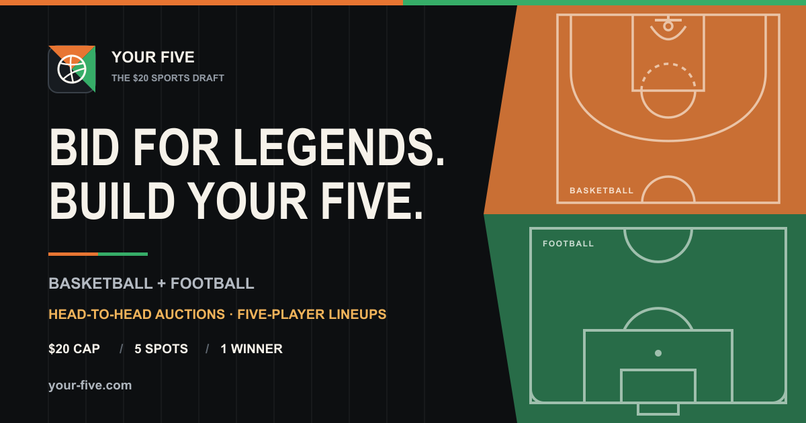
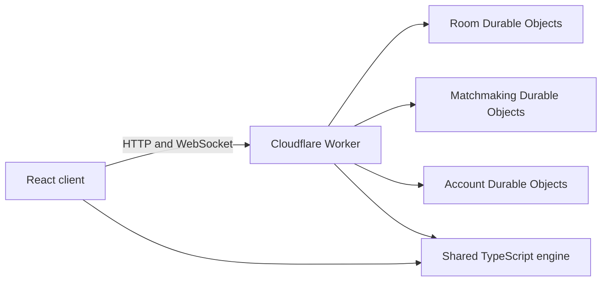

# Your Five

[](https://your-five.com)

Your Five is a head-to-head sports auction draft game. Two GMs share a `$20` cap, bid on legendary players, and build the strongest five-player lineup across basketball or football.

**Play it live:** [your-five.com](https://your-five.com)

## Features

- Basketball and six selectable football competition pools with sport-specific scoring and lineup rules.
- Head-to-head auctions with a hard cap, roster reserve, and escalating skip costs.
- Unlimited AI drafts with Casual, Competitive, and Expert opponents.
- A deterministic daily challenge and reproducible challenge links.
- Random online matchmaking and private rooms powered by Cloudflare Durable Objects and WebSockets.
- Responsive court and pitch lineups with drag, tap, and keyboard position controls.
- Google sign-in with synchronized records, recent drafts, streaks, and achievements.
- Guest play that keeps progress locally without requiring an account.

## How It Works

Each GM starts with `$20` and five empty roster spots. Players are revealed one at a time. The active GM can open the bidding or use a skip, and the opponent can raise or concede. Every lineup must retain enough money to fill its remaining spots.

Basketball lineups use `PG`, `SG`, `SF`, `PF`, and `C`. Football lineups use `GK`, `DEF`, `MID`, `ATT-L`, and `ATT-R`. Players can be rearranged after drafting, but playing outside a sourced position applies a sport-specific penalty.

The final score combines individual card quality with player honors, team success, lineup fit, chemistry, and position penalties. The full calculation is visible in each result.

## Architecture



| Workspace | Purpose |
| --- | --- |
| `client/` | React, Vite, routing, game UI, local progress, and Cloudflare Pages assets |
| `shared/` | Sport-neutral auction engine, player databases, scoring, AI, protocols, and tests |
| `worker/` | WebSocket rooms, matchmaking, reconnects, timers, rate limits, and Google accounts |
| `scripts/` | Football data generation and offline provenance validation |

Basketball and every football competition have separate lazy-loaded runtimes, so a session downloads only the database used by its draft.

## Local Development

### Requirements

- Node.js 20 or newer
- npm 10 or newer
- A Cloudflare account only when deploying

Install all workspaces:

```bash
npm ci
```

Start the Worker in one terminal:

```bash
npm run dev:worker
```

Start the client in another terminal:

```bash
npm run dev:client
```

Open [http://localhost:5173](http://localhost:5173). The local Vite server proxies room, matchmaking, and health requests to the Worker at `http://localhost:8787`.

Guest mode works without credentials. Google sign-in requires the optional setup below.

## Google Sign-In

Your Five uses Google's authorization-code flow with PKCE. The Worker verifies Google's signed ID token, creates a signed HttpOnly session cookie, and stores account progress in a dedicated Durable Object. It requests only `openid`, `email`, and `profile`.

Create a Google OAuth **Web application** with:

- Authorized JavaScript origin: `https://your-five.com`
- Authorized redirect URI: `https://api.your-five.com/auth/google/callback`
- Authorized domain: `your-five.com`

Configure the Worker secrets:

```bash
npx wrangler secret put GOOGLE_CLIENT_ID --config worker/wrangler.jsonc
npx wrangler secret put GOOGLE_CLIENT_SECRET --config worker/wrangler.jsonc
npx wrangler secret put SESSION_SECRET --config worker/wrangler.jsonc
```

Generate a session secret with:

```bash
openssl rand -base64 48
```

For local sign-in testing, add `http://localhost:8787/auth/google/callback` to the Google OAuth client and create `worker/.dev.vars`:

```dotenv
GOOGLE_CLIENT_ID=your-client-id
GOOGLE_CLIENT_SECRET=your-client-secret
SESSION_SECRET=your-generated-session-secret
FRONTEND_ORIGIN=http://localhost:5173
```

Never commit OAuth credentials or `.dev.vars`.

## Tests

Run the focused suites from the repository root:

```bash
npm run test:engine
npm run test:reliability
npm run test:ai
npm run test:ai-storage
npm run test:progress
npm run test:accounts
npm run test:soccer
npm run test:football-domestic
```

The Cloudflare integration suite expects the local Worker to be running on port `8787`:

```bash
npm run dev:worker
npm run test:cloudflare
```

Build the production client with:

```bash
VITE_SERVER_URL=https://api.your-five.com npm run build -w client
```

## Data

Production games use committed static databases and make no live requests to sports data providers.

- Basketball season statistics are sourced from NBA.com through the open-source `nba_api` client. Positions and historical achievements are stored explicitly.
- The all-time football pool uses official UEFA selections and UEFA club-competition match records.
- The five 2025-26 domestic pools use the 11 players with the most official league starts for every Premier League, LaLiga, Serie A, Bundesliga, and Ligue 1 club. Official starting lineups determine the ranking.
- Football provenance records source URLs, retrieval times, content hashes, source identities, fixtures, position labels, rankings, field-level metric sources, coverage checks, and accolade sources.
- Missing football metrics are omitted rather than guessed, and the generator fails on incomplete or non-finite source data.

Regenerate or verify the football database with:

```bash
npm run data:soccer
npm run verify:soccer-data
npm run data:football-domestic
npm run verify:football-domestic
```

## Deployment

The production frontend runs on Cloudflare Pages and the API runs on a Cloudflare Worker at `api.your-five.com`.

Deploy the backward-compatible Worker first:

```bash
npm run deploy:worker
```

Then build and deploy the frontend:

```bash
VITE_SERVER_URL=https://api.your-five.com npm run build -w client
npx wrangler pages deploy client/dist --project-name your-five --branch main
```

Deploying the Worker first matters when a release changes the room protocol, account progress, or Durable Object behavior.

## Project Notes

- Your Five is an independent fan-made game.
- It is not endorsed by any player, club, team, league, federation, ratings publisher, or data provider referenced by the project.
- Player data corrections should include the card, edition, and a supporting primary source.
